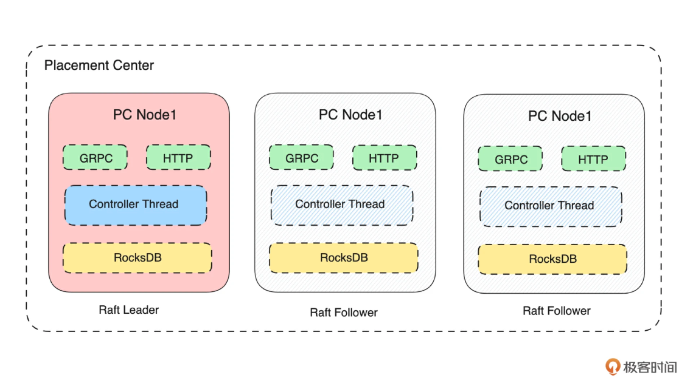
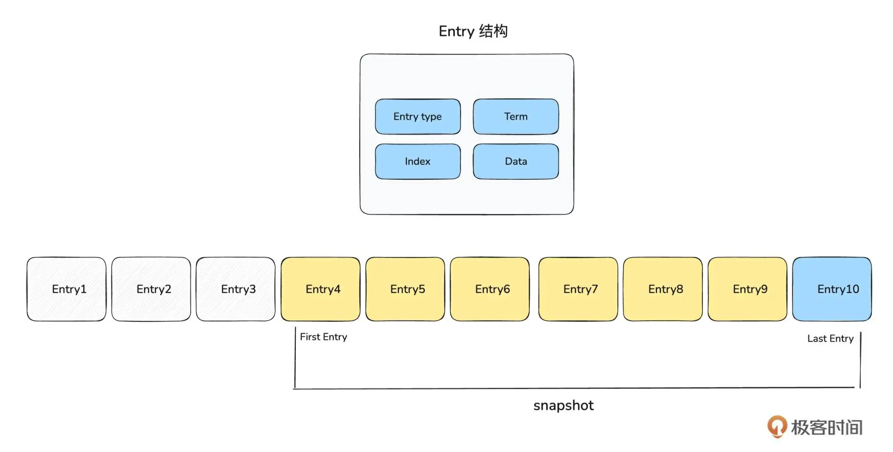
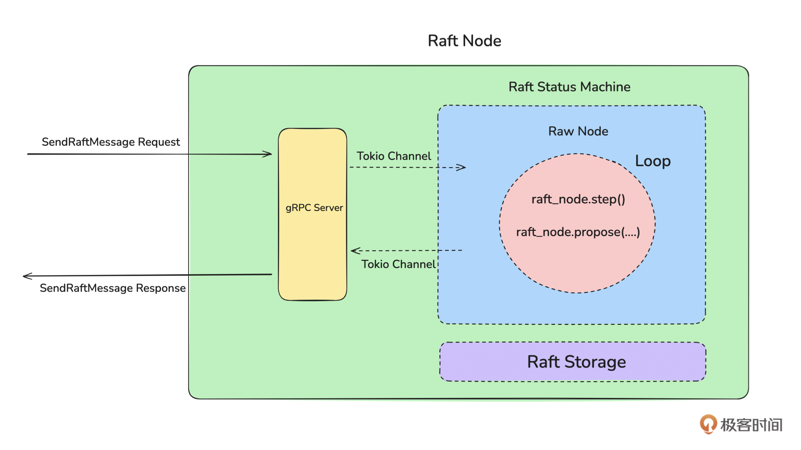
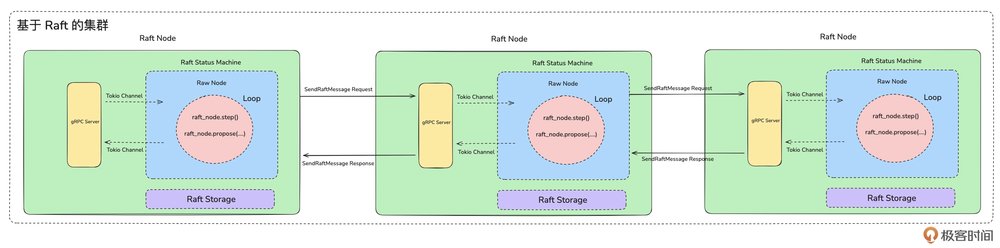

# nezamq
rust study project

## 任务一： 项目结构：组织、编译、打包rust项目

```
├── Cargo.toml # Cargo 的定义文件
├── LICENSE # 项目 的LICENSE 文件，比如Apache2.0 (暂无)
├── README.md # 项目说明 README文件
├── benches # 压测代码所在目录
├── bin # 项目启动命令存放的目录
├── build.rs # cargo中的构建脚本 build.rs。可参考这个文档:https://course.rs/cargo/reference/build-script/intro.html
├── config # 存放配置文件的目录
├── docs # 存放技术文档的目录
├── example # 存放项目调用 Demo 的项目
├── Makefile # 用于编译打包项目的makefile文件
├── Justfile # 用于编译打包项目的justfile文件
├── src  # 源代码目录
│   ├── cmd
│   │   ├── Cargo.toml
│   │   ├── src
│   │   │   └── placement-center
│   │   │       └── server.rs
│   │   └── tests
│   │       └── test.rs
│   ├── placement-center
│   │   ├── Cargo.toml
│   │   ├── src
│   │   │   └── lib.rs
│   │   └── tests
│   │       └── test.rs
│   └── protocol
│       ├── Cargo.toml
│       ├── src
│       │   └── lib.rs
│       └── tests
│           └── test.rs
├── tests # 存放测试用例代码的文件
└── version.ini  # 记录版本信息的文件
```

## 任务二：项目初始化：命令行参数、配置、日志、测试用例

### 1. 命令行参数

Rust处理命令行参数推荐使用 clap 库。

```
cargo add clap -F derive

```

### 2.配置
需求目标：能从命令行接受配置文件路径
静态文件配置：使用toml文件，使用toml库

### 3. 日志

日志核心四个需求：

1. 支持多个不同的日志级别。
2. 支持多种日志滚动方式，比如按时间滚动、按大小滚动。
3. 支持自定义日志格式。
4. 支持根据不同的类型将日志打印到不同的文件。

日志库： log4rs

初始化日志模块主要分为三步：

1. 编写 log4rs.yaml 文件。
2. 初始化日志模块。
3. 记录日志。

用户使用日志，一般只需要去修改存储路径，这个是常见需求
希望用户不部份情况下不用起理解 log4rs 的语法，且修改日志存放目录时，不需要修改 log4rs.yaml 中的路径

### 4. 运行测试用例
一般会把测试用例和代码写在一起。

测试用例的逻辑：初始化某个数据，然后判断数据是否符合预期。

测试Server来提供服务，使用脚本来测试。

```shell
#!/bin/sh
start_placement_center(){
    nohup cargo run --package cmd --bin $placement_center_process_name -- --conf=tests/config/$placement_center_process_name.toml >/dev/null 2>&1 &
    sleep 3
    while ! ps aux | grep -v grep | grep "$placement_center_process_name" > /dev/null; do
        echo "Process $placement_center_process_name has not started yet, wait 1s. . . ."
        sleep 1
    done
    echo "Process $placement_center_process_name starts successfully and starts running the test case"
}

stop_placement_center(){
    pc_no= `ps aux | grep -v grep | grep "$placement_center_process_name" | awk '{print $2}'
    echo "placement center num: &pc_no"
    kill $pc_no
    sleep 3

    while ps aux | grep -v grep | grep "$placement_center_process_name" > /dev/null; do
        echo "Process $placement_center_process_name stopped successfully "
        sleep 1
    done
}

start_placement_center

cargo test

if [ $? -ne 0 ]; then
    echo "Test case failed to run"
    stop_placement_center
    exit 1
else
    echo "Test case runs successfully"
    stop_placement_center
fi

```
shell 脚本说明：

```
nohup: 用于让命令在后台运行，即使终端关闭，进程也不会被终止。

cargo run: 运行 Rust 项目。

--package cmd: 指定要运行的 Cargo 工作空间中的包（cmd 是包名）。

--bin $placement_center_process_name: 指定要运行的二进制文件名称（$placement_center_process_name 是一个变量，表示二进制文件名）。

-- --conf=tests/config/$placement_center_process_name.toml: 传递给 Rust 程序的参数，指定配置文件路径。

>/dev/null 2>&1: 将标准输出（stdout）和标准错误（stderr）重定向到 /dev/null，即丢弃所有输出。
(将 nohup 的输出重定向到日志文件，而不是丢弃,可以写成 nohup cargo run --package cmd --bin $placement_center_process_name -- --conf=tests/config/$placement_center_process_name.toml > app.log 2>&1 &)

&: 将命令放到后台运行。

ps aux: 列出当前系统中所有进程的信息。

grep -v grep: 过滤掉 grep 命令本身的进程（因为 grep 也会出现在进程列表中）。

grep "$placement_center_process_name": 查找包含 $placement_center_process_name 的进程。

> /dev/null: 将 grep 的输出重定向到 /dev/null，即丢弃输出（只关心命令的退出状态）。

while ! ...: 如果 grep 没有找到匹配的进程（即进程未启动），则进入循环。

echo "Process $placement_center_process_name has not started yet, wait 1s....": 输出提示信息，表示进程尚未启动。

sleep 1: 等待 1 秒后再次检查。

ps aux: 列出当前系统中所有进程的详细信息。

grep -v grep: 过滤掉 grep 命令本身的进程（因为 grep 也会出现在进程列表中）。

grep "$placement_center_process_name": 查找包含 $placement_center_process_name 的进程。

awk '{print $2}': 提取进程列表的第二列，即进程 ID（PID）。

pc_no=: 将提取到的进程 ID 赋值给变量 pc_no。

kill $pc_no: 向进程 ID 为 $pc_no 的进程发送终止信号（默认是 SIGTERM），要求进程优雅退出。
（强制终止: 如果进程没有响应 SIGTERM，可以使用 kill -9 $pc_no 强制终止进程。）

ps aux | grep -v grep | grep "$placement_center_process_name": 检查是否还存在名为 $placement_center_process_name 的进程。

> /dev/null: 将 grep 的输出重定向到 /dev/null，即丢弃输出（只关心命令的退出状态）。

while ...: 如果进程仍然存在（即未成功停止），则进入循环。

echo "”Process $placement_center_process_name stopped successfully": 输出提示信息，表示进程仍在运行。

sleep 1: 等待 1 秒后再次检查。

多进程处理: 如果存在多个同名进程，当前脚本只会终止第一个找到的进程。可以使用循环终止所有同名进程：
for pid in $(ps aux | grep -v grep | grep "$placement_center_process_name" | awk '{print $2}'); do
    kill $pid
done

$?: 这是一个特殊变量，表示上一个命令的退出状态码。
    如果命令成功执行，$? 的值为 0。
    如果命令执行失败，$? 的值非 0。

-ne: 表示“不等于”（not equal）。

[ $? -ne 0 ]: 判断上一个命令的退出状态码是否不等于 0（即是否执行失败）。
```

### 5. 网络层Server端

网络Server模块的核心：从业务需求视角出发，分析Server应该具备哪些能力，从而根据这些信息选型出技术层面网络层和应用层的协议。

网络Server模块选型

元数据服务(Placement Center)的架构图：


在前面的定义中，我们的元数据服务有两个功能：

1. 分布式的kv存储能力：需要给 Broker 集群提供分布式的 KV 存储能力，从性能来看，需要支持较高并发的读写。

2. 集群管控和调度能力：根据运行信息对 Broker 集群进行管控、调度，比如元数据更新、Leader切换等等。

所以从网络模块的角度来看，就需要能支持：较高的吞肚和并发能力。

基于gRPC协议来实现我们的Server:

1. gRPC 是标准的网络通讯框架，具备现成的 Server 端和多语言 SDK。基于gRPC框架实现网络 Server 会极大地降低开发成本。

2. gRPC 协议底层是基于 HTTP2 和 Protobuf 来实现数据通信的，具备较高的吞吐性能。

3. 元数据服务是用来给 Broker 集群提供服务的，所以从业务特点上不会有非常高的数据量的吞吐。

4. 元数据服务是集群化部署，允许多节点快速横向部署扩容，不需要单机具备极高的性能。

另外作为一个元数据存储服务，它一般需要提供 HTTP 协议的接口来给管控页面或者用户做一些管理操作。比如增删改查集群、用户、权限信息，查看集群运行的监控数据等等。
所以还需要提供HTTP协议的Server来支持这类场景。

总结来说，元数据服务需要提供基于 gRPC 协议的数据面 Server 和基于 HTTP 协议的管控面 Server。

基于 Axum 支持 HTTP Server。

元数据服务需要提供管控功能，需要提供 HTTP 协议的对资源的增删改查接口：

* 支持 Restful 规范的 HTTP 接口。
* 支持多版本接口的管理。
* 返回JSON格式的请求和返回。
* 支持在接口中处理各种业务逻辑，比如数据读写、缓存读取等。


基于 Tonic 实现 gPRC Server

1. 编写 protobuf 文件，即通过 protobuf 语法定义 RPC 的方法和参数
2. 编译 protobuf 文件
3. 在服务端，实现 RPC Service
4. 启动 gRPC Server
5. 运行测试用例


HTTP Server 和 gRPC Server 的实现要点以及主体框架的开发：

* Tokio: Rust 异步运行的标准库。
* Axum: Rust 语言的 HTTP Web 框架。
* Tonic: Rust 语言的 gRPC 框架的实现。
* Prost：Protocol BUffers 的 Rust 语言的实现，Tonic 及其相关库（tonic_build）关于 Proto 部分都是用这个库。

tokio spawn、tokio signal、tokio broadcast channel 来实现并行运行多个服务和程序平滑退出的能力。

### 6. 数据存储

如何实现存储层？从技术来看，一般有是三个思路：

1. 基于文件系统从头实现数据存储。// 不推荐
2. 基于现有成熟的分布式存储引擎完成数据存储，比如 Zookeeper、etcd等。//成熟方案，外部依赖
3. 基于现有成熟的嵌入式键值数据库实现，比如RocksDB、LevelDB等。//成熟方案，本地嵌入

需求：高内聚和低外部依赖。选RocksDB

```
RocksDB 简介：
从功能层面上来看，RocksDB 它是一个嵌入式的键值存储引擎，它提供了下面几个主要的功能函数调用：

* Put(key,Value): 插入新的 Key-Value 对或更新现有 Key 的值。
* Get(Key)：获取特定 Key 的值。
* Delete(Key): 删除特定 Key 的值。
* Merge(Key,Value): 将新值与给定 Key 的现有值合并。
* Seek(key_prefix)：匹配指定 Key 的前缀或大于 Key 的前缀。

从代码层面来看， RocksDB 就一个Lib，不是一个Server，是一个被项目引用的库。
也就是说它没有独立的进程运行，是和主进程共享内存空间。

从底层存储的角度来看，RocksDB 的数据是存储在单机本地硬件的文件中，他是本地存储的。
它是基于 LSM-Tree(Log-Structured Merge Tree) 实现的一种本地存储引擎。

列蔟（ColumnFamily）:
ColumnFamily 是 RocksDB 中的一个逻辑概念，它的功能是用于 key 的组织。
ColumnFamily 和 Key 的关系，类似于 Mysql 中的 Database 和 table 的关系。
Database 用于 table 的逻辑组织，table 一定属于某个 Database。
默认情况下，RocksDB 中所有的 Key 都在一个默认的 ColumnFamily 中。

```

Rust 需要通过 Rust 库 rocksdb 来使用 RocksDB。从代码实现的层面看，主要包含下面七个部分：

* 构建 RocksDB 配置
* 初始化 RocksDB 实例
* 写数据（Write）
* 根据 Key 读取数据（Get）
* 根据 Key 删除数据（Delete）
* 判断 Key 是否存在（Exists）
* 根据前缀读取数据（read_prefix）

1. 构建 RocksDB 配置

构建配置的主要工作是设置 RocksDB 实例的配置选项（Options）。
难点在于：要理解 RocksDB 的运行原理，每个配置项的意义，然后根据自己的场景和要求进行配置优化。

2. 初始化 RocksDB 实例

对于初始化后的 instance 全局只能有一个。
即一个 RocksDB 目录只能同时被一个实例持有，不能多次 Open 一个 RocksDB 目录，否则就会报错。
实际使用中，需要通过Arc在多线程之间共享 RocksDB instance。

3. 写数据

写入数据必须选择 ColumnFamily，原因是作为元数据服务，它需要存储不同类型的数据，并且长期可能有较大的数据。
为了长期扩容、拆分、隔离的方便，就需要将数据进行逻辑拆分。

4. 读（Get）/删除（delete）数据，并判断数据是否存在（Exists）

读数据是通过 RocksDB 的 get_cf 方法来获取数据，Decord 后返回即可。

删除和判断数据是否存在是通过 delete、key_may_exist_cf 函数来完成功能。

5. 前缀搜索

RocksDB 底层存储数据时是根据 Key 排序存储的，所以前缀搜索的底层逻辑是：
先通过 seek 方法找到该前缀对应的第一个 Key，
再通过 next 方法一个一个往后获取数据，
从而得到该前缀对应的所有 Key。

KV型的数据存储
使用 RocksDB 存储 KV数据，使用 StorageDataWrap 来包装数据，可以存储结构化数据

### 7. 基于 Raft 协议构建分布式集群

从技术上来看，实现分布式存储需要两步：

1. 构建基于某个一致性协议的分布式集群。
2. 在构建完成的分布式集群上存储数据。

为什么是 Raft 协议？

1. 肯定是选择现成的合适的一致性协议。
2. 从功能上来看，Raft协议和其他一致性协议都满足Placement Center 功能定义上的需求。
3. Rust中有比较成熟的 Raft 协议库，并且已经在成熟项目中使用，其他协议不满足这个条件。

另外，协议要满足业务需求，对于Placement Center 所提供的功能、数据量、QPS 来看，它的业务特点主要是存储元数据，不会有非常大的数据量，
但是需要数据的可靠性，不能丢数据。
Paxos 的工程化落地非常难，Raft本身就是为了简化Paxos的工程实现而出现。
最后考虑的是项目库的成熟度如何，是否具备工业化使用基础，就是看有没有成熟项目在使用：

Rust 中的 Raft 实现主要有 openraft 和 raft-rs 两个库，最后选择 raft-rs库，主要是因为：

1. raft-rs是 TIDB 开源的库，已经经过了 TiKV 这个成熟项目的验证。
2. 它只实现了 Raft 协议中的共识算法部分，其他部分自己实现，比如网络、存储层。从长远角度考虑，自主实现的越多，可控性越高，那么优化就越好做。

实现基于Raft协议的分布式集群要做什么？

首先需要了解Raft协议：Raft 是一种分布式一致性算法，用于管理分布式系统中的日志复制和状态机一致性。它的设计目标是易于理解和实现，同时提供与 Paxos 算法相同的强一致性保证。Raft 通过将问题分解为领导选举、日志复制和安全性三个子问题，简化了分布式系统的开发。

```
Raft 简单介绍：

1. 核心概念

* 节点角色

Raft 集群中的每个节点可以处于以下三种角色之一：

Leader（领导者）：负责处理客户端请求、管理日志复制。

Follower（跟随者）：被动接收来自 Leader 的日志条目和心跳。

Candidate（候选者）：在 Leader 失效时，参与选举以成为新的 Leader。

* 任期 （Term）

Raft 将时间划分为多个任期（Term），每个任期是一个连续的时间段。

每个任期从一次选举开始，选举成功后，Leader 在该任期内管理集群。

如果选举失败，则开始一个新的任期。

* 日志（Log）

每个节点维护一个日志，日志由一系列日志条目组成。

每个日志条目包含：

索引（Index）：日志条目的位置。

任期（Term）：创建该条目的任期。

命令（Command）：客户端请求的操作。

* 状态机（State Machine）

当日志条目被提交（committed）后，状态机会按顺序执行这些条目中的命令，从而保证集群的一致性。

2. Raft 的工作流程
Raft 的工作流程可以分为三个主要部分：

* 领导选举（Leader Election）
当 Follower 在一段时间内未收到 Leader 的心跳时，它会认为 Leader 失效，并开始选举。

Follower 转换为 Candidate，增加当前任期号，并向其他节点发送投票请求。

如果 Candidate 收到大多数节点的投票，则成为新的 Leader。

如果多个 Candidate 同时发起选举，可能会导致选举失败，此时会开始新的任期并重新选举。

* 日志复制（Log Replication）

Leader 接收客户端请求，将请求作为日志条目追加到自己的日志中。

Leader 将日志条目复制到所有 Follower 节点。

当日志条目被大多数节点复制后，Leader 将该条目标记为已提交（committed），并通知 Follower 提交该条目。

Follower 提交日志条目后，将其应用到状态机中。

* 安全性（Safety）

Raft 通过以下机制保证安全性：

选举限制：只有拥有最新日志的节点才能成为 Leader。

日志匹配：Leader 和 Follower 的日志必须保持一致。

提交规则：只有当前任期的日志条目才能被提交。

* Raft 的优势

易于理解：Raft 将问题分解为多个子问题，并通过清晰的术语和流程简化了理解。

强一致性：Raft 保证在任何时刻，集群中只有一个 Leader，且所有节点的日志最终一致。

高可用性：即使部分节点失效，集群仍能继续工作。

易于实现：Raft 的设计使得它比 Paxos 更容易实现和调试。

4. Raft 的应用场景
Raft 广泛应用于需要强一致性的分布式系统中，例如：

分布式数据库：如 TiDB、CockroachDB。

分布式存储系统：如 etcd、Consul。

分布式配置管理：如 ZooKeeper 的替代方案。

5. Raft 的局限性
性能开销：Raft 需要频繁的心跳和日志复制，可能会影响性能。

网络分区问题：在网络分区的情况下，可能会出现多个 Leader，导致脑裂问题（Raft 通过任期机制避免了这一问题）。

扩展性限制：Raft 的性能会随着集群规模的增加而下降。

6. Raft vs Paxos
特性	Raft	Paxos
易理解性	高（通过分解问题和清晰的术语）	低（复杂且难以理解）
实现难度	低	高
强一致性	是	是
性能	中等	高
应用场景	中小规模分布式系统	大规模分布式系统
7. Raft 的实现
Raft 的经典实现包括：

etcd：一个分布式键值存储系统，使用 Raft 实现一致性。

TiKV：一个分布式事务键值存储系统，基于 Raft 实现。

Hashicorp Raft：一个用 Go 语言实现的 Raft 库。

总结
Raft 是一种简单而强大的分布式一致性算法，适用于需要强一致性和高可用性的分布式系统。它的设计使得开发者能够更容易理解和实现分布式系统，同时提供了与 Paxos 相同的强一致性保证。

```

基于raft-rs 库来构建群就有四个主要工作：

1. 构建存储层：即实现用于持久化存储 Raft Log 数据的存储层。在我们项目中，使用 RocketDB 来实现。
2. 构建网络层：即实现用于在多个 Raft 节点之间进行通信的模块。在我们项目中，使用 gRPCl 来实现。
3. 构建单节点 Raft 状态机：比如分发数据、检测心跳、切换Leader等等。
4. 整合状态机、存储层、网络层：构建成一个完整的 Raft 集群。

存储层的实现：

Raft Log 和 Storage Trait


Raft Log 本质上是一系列 Entry 组成的顺序存储的日志。
Entry 表示一个 Raft Log，为了节省存储空间和加快快照的生成速度，一些没用的 Raft Log 需要清理删除。
所以 First Entry 是指至今还保存的最早的那条 Entry，Last Entry 是指最新的那条 Entry。
快照一般指当前所有有效的 Entry 的集合。

因此 Raft Log 的核心其实是 Entry。每一个 Entry 由 Entry Type、Index、Term、Data 四部分组成。

* Entry type: 表示该 Entry 包含什么类型的数据，如下枚举所示，有普通数据和配置变更数据两种类型。
* Index: 指这个 Entry 在顺序存储的日志中的偏移量。
* Term: 是 Raft 协议中的概念，用于保证 Raft Log 的一致性和顺序性。Term 从 0 开始，如果 Leader 切换一次，
Term 就会 +1，每一个 Entry 都有属于自己的 Term。
* Data: 是 Raft Log 的具体内容，不同 Entry Type 的内容是不一样。


Raft 算法由下面六个核心流程组成：

1. 节点发现
2. 发起选举
3. 选举 Leader
4. 心跳检测
5. 心跳超时
6. 重新发起选举

Raft状态机的本质是一个 Tokio 的任务（也就是 Tokio Task）。

如上图所示，Raft Node 主要由 gRPC Server、Raft 状态机、Raft Storage 三部分组成。
其中最关键的是Raft 状态机，它驱动了 Raft Node 向前运行。
从启动流程的角度看，服务启动后，会先启动 gRPC Server，初始化 RawNode，然后启动 Raft 状态机。
Raft 状态机本质上是一个 Loop 线程，它会不间断地运行去驱动 RawNode 向前运行。

那什么叫做 RawNode 向前运行呢？

是指每个 RawNode 初始化后，需要根据自己的角色不断地做一些事情。比如，如果是 Leader 节点，那么就需要检测是否
有新的用户数据写入，并将用户数据分发给多个 Follower，同时需要定时给 Follower 节点发送心跳信息。如果是 Follower 
节点，则需要定时查看是否有心跳，如果有心跳则继续等待下一次心跳，如果心跳过期则发起新的选举。
而这些操作都是由 Raft 状态机来驱动的。

不管是 Leader 还是 Follower 的信息，当 Raft 状态机生成消息后，都会通过 Tokio channel 将消息从网络层发送给其他节点。
从而完成发起选举、投票选举 Leader、发送心跳等行为。所以，从集群的角度来看，整体架构图如下：


基于上面集群的架构图，Raft 算法中的六个核心流程：

1. 节点发现：Raft Node 之间相互发现是在启动时通过 ConfState 中的 voters 变量来配置的。

 ```rust
    // 初始化 Raft 的投票者列表
    let mut cs=storage.read_lock().conf_state();
    cs.voters=cluster.voters;
 ```

2. 选举（发起选举和选举 Leader）: RaftNode 启动时， Raft 状态机会根据配置的 voters 节点信息，
从其他节点获取当前是否有 Leader，有的话就将自己转变为 Follower角色，然后根据 Follower 的角色视角
去驱动 Raft 状态机的运行。如果当前集群没有 Leader，则 Raft 状态机会发起选举，也就是生成 MsgType 为
 MsgRequestVote 的消息，将消息通过 Tokio Channel 发送给网络层，再通过网络层发送给其他 Raft Node。

3. 心跳检测: Raft Leader 运行时，Raft 状态机会不间断生成 MsgType 为 MsgHeartbeat 的消息，
并将消息发送给 Follower。当 Follower 收到 MsgType 为 MsgHeartbeat 的消息时，会给 Leader 返回
MsgType 为 MsgHeartbeatResponse 的消息。

4. 心跳过期 & 重新发起选举：当 Follower 状态机向前驱动时，如果检测到心跳过期，那么则生成 MsgType 为
 MsgRequestVote 的消息，发起一次新的选举。

 Raft 集群的运行是依靠 Raft 状态机不断地向前驱动去生成不同类型的消息，从而完成不同的操作。

Raft 状态机的实现：

* Raft Node: 指 Raft 中的投票者节点，一般一个物理节点（或服务进程）就是一个 Raft Node。
* RaftNode: 是 raft-rs库的一个结构体，用于初始化一个投票者。
* Raft 状态机：指服务进程中驱动 RawNode 状态运行的线程。一般情况下，一个 RawNode 对应一个 Raft 状态机，也就是一个线程。
用于避免多个 RawNode 运行在同一个线程中相互影响。

状态机运行流程：进程启动，启动 gRPC Server，启动状态机，状态机会自己运行，找到 Leader 或发起 Leaer 选举。
根据自身的角色生成不同的消息，通过 Tokio Channel 发送给网络层，并通过网络层发送给其他节点，
从而和其他 Raft 节点互动，进而完成集群的组建。

优化点：异步快照构建、高性能的快照同步和恢复、Raft日志存 RocksDB 写放大问题、Raft 节点之间高性能的消息同步等等。

